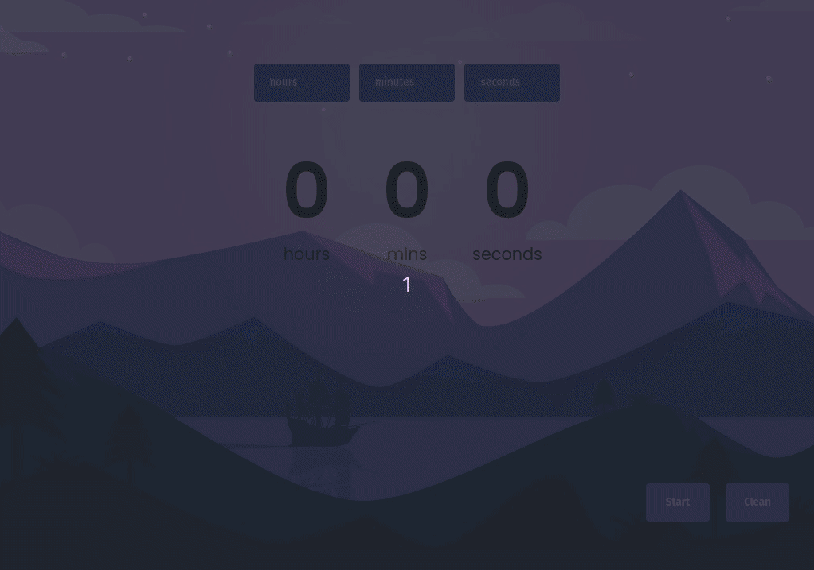

## Description:
On this project I intended to create a simple countdown timer to help on daily tasks by managing time and keeping users aware of time speeding.
Since it's a simple application, there was no reason for using any framework.
- DOM and Selector
- Working with Elements
- Events

## Starting Project:
1. Cloning the repository
-  `git clone git@github.com:Vincenzofdg/Countdown.git`
2. Enter in the directory folder
- `cd Countdown`
3. Iniciate `server.mjs`
- `node server.mjs`

 

